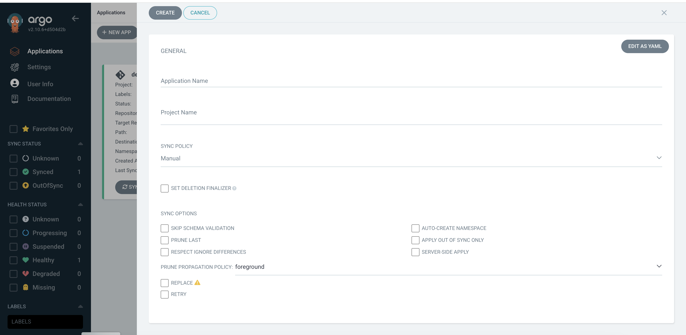
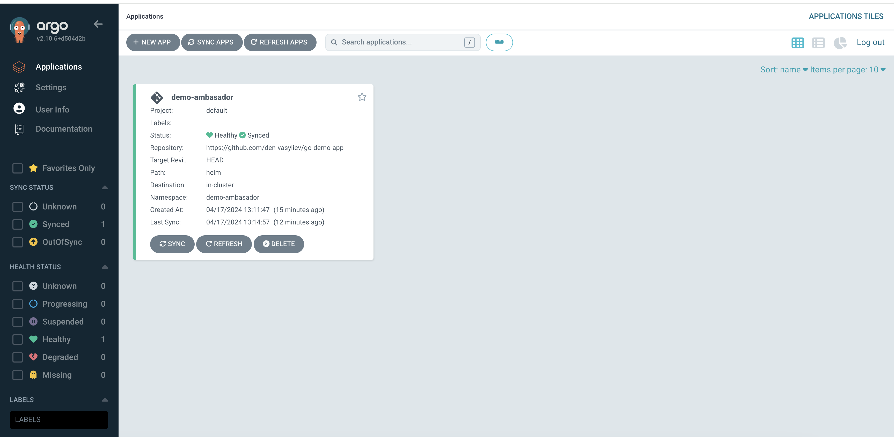

# Ambasador MVP Demo

## Installation
Before deploy application please setup ArgoCD and local cluster by using this instruction: [Instruction](POC.md).


## Argo CD Application Setup

Create new application


Application after creation:


## Check Project 

Forward Ambasador service port 
```bash
kubectl port-forward -n demo-ambasador svc/ambassador 8000:80
```

Check that server answer:
```bash
curl localhost:8000
```

Upload image to get in ASCI symbols
```bash
curl -F 'image=@NewTux.png' localhost:8000/img/
```

### Live Demo

